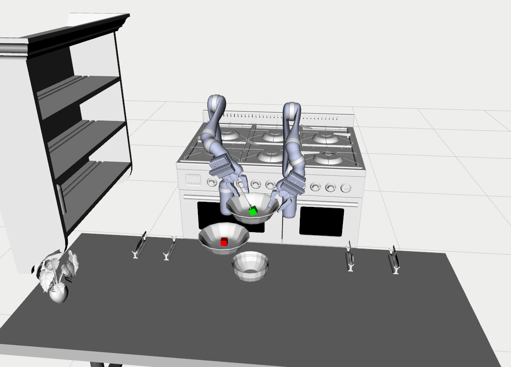

# WeCook
<p align="center">

</p>

> :warning: **Warning:** WeCook is under heavy development. These instructions are
> primarily for reference by the developers.

WeCook is a platform for long horizontal robotic manipulation 
and human-robot collaboration research.

## Setup Instructions
**WeCook depends on [AIKIDO](https://github.com/personalrobotics/aikido), [z3](https://github.com/Z3Prover/z3)** 

**WeCook is supported on the following systems:**
- Ubuntu 18.04 / ROS Melodic
- Ubuntu 16.04 / ROS Kinetic

### [Setup Instructions](docs/instructions.md)

## [Usage](#usage)
There are two types of tasks WeCook supports, "following" and "planning". In the "following" mode, agents will follow 
action sequences given by users; in the "planning" mode, agents will plan a task and motion path based on PDDL files 
defined by users based on [IDTMP](https://www.cs.rice.edu/~sc40/pubs/dantam2016tmp.pdf). Moreover, WeCook supports 
both simulated and real robots. It's easy to switch between different modes and real/sim by editing task scripts.

### "Following" (sim)
<p align="center">

</p>

**To run the demo, type in following commands in your terminal**

```bash
# Open one terminal
$ roscore
# Open another terminal
$ rviz
# Open another terminal
$ rosrun wecook wecook
# Open another terminal
$ rosrun wecook fruit_jelly.py
```
### "Following" (real)
**Coming soon!**
### "Planning" mode (sim)
**Coming soon!**
### "Planning" mode (real)
**Coming soon!**


