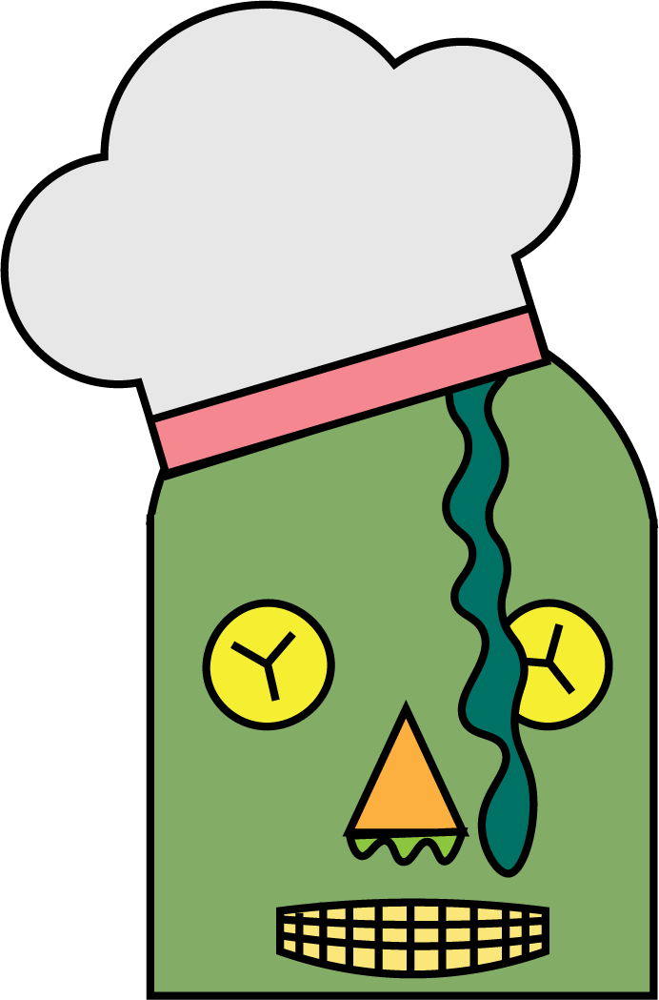

# Overview
WeCook is a C++ framework started by the Interactive and Collaborative Autonomous Robotics (ICAROS) lab at University of Southern California (USC). It is a platform for testing and analyzing planning algorithms for long-horizontal robotic manipulation and human-robot collaboration. 

We hope you find this tool useful. Please contact our team if you wish to share your comments, questions, success stories, or frustrations. And please contribute your best bug fixes, features, and examples!

